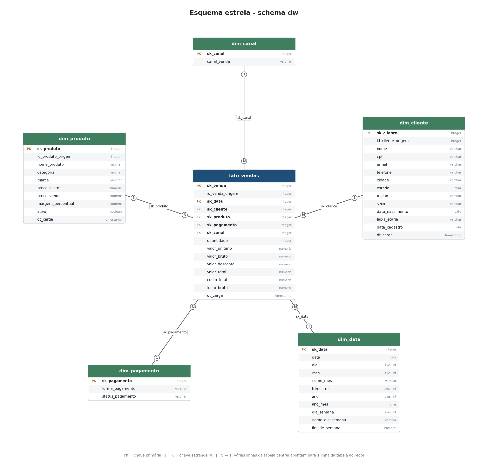
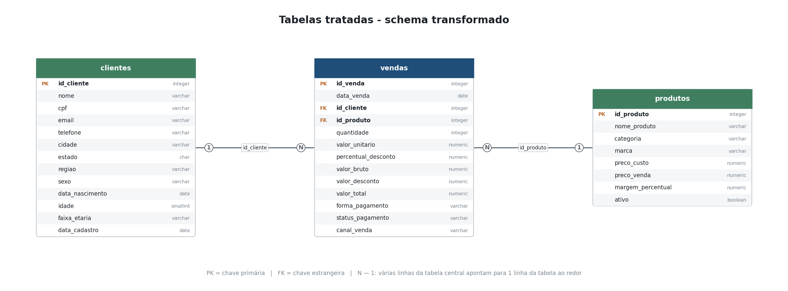
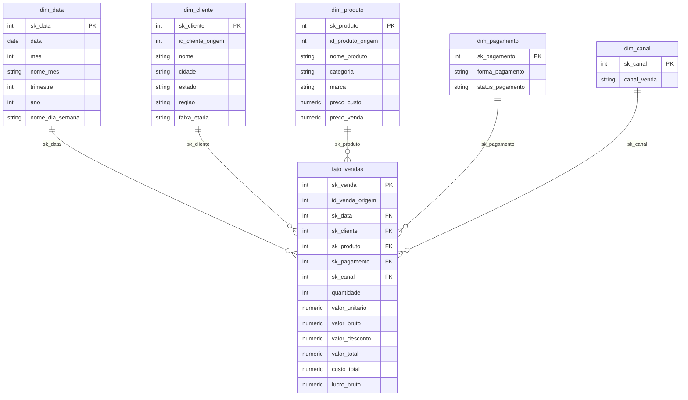

# Semana 10 - ETL local de Vendas (PostgreSQL no Docker + CSVs para Power BI)

Pipeline de ETL em Python, no mesmo padrão do projeto `exemplo/` da
Semana 6, agora com dados de **vendas** de uma loja de suplementos e
produtos saudáveis. Ele lê 3 arquivos CSV brutos (vendas, clientes e
produtos), trata os dados, grava em um **PostgreSQL rodando em Docker** e
entrega três conjuntos de arquivos:

| Pasta                  | Conteúdo                                                        | Para que serve |
|------------------------|-----------------------------------------------------------------|----------------|
| `dados/origem/`        | `vendas.csv`, `clientes.csv`, `produtos.csv` **brutos**         | Importar direto no Power BI e tratar no Power Query |
| `dados/transformado/`  | Os **mesmos 3 arquivos**, já tratados pelo ETL                  | Comparar com a origem / importar já limpo |
| `dados/estrela/`       | `fato_vendas.csv` + 5 dimensões (`dim_*.csv`)                   | Modelo dimensional (esquema estrela) pronto para o Power BI |

No banco, os mesmos resultados ficam em dois schemas: `transformado`
(3 tabelas tratadas) e `dw` (esquema estrela).

## Fluxo

```
dados/origem/*.csv ──► Extract ──► Transform ──► Load ──► PostgreSQL (Docker)
   (dados brutos)      (pandas)     (pandas)               ├─ schema transformado ──► dados/transformado/*.csv
                                                           └─ schema dw (estrela) ──► dados/estrela/*.csv
```

## Relacionamento das tabelas

### Esquema estrela (schema `dw`)



- **Fato**: `fato_vendas` - uma linha por venda, com as métricas
  (quantidade, valor unitário, valor bruto, desconto, valor total, custo
  total e lucro bruto).
- **Dimensões**: `dim_data`, `dim_cliente`, `dim_produto`,
  `dim_pagamento` (forma + status do pagamento) e `dim_canal`.
- Todos os relacionamentos são **1 para N** da dimensão para a fato.

### Tabelas tratadas (schema `transformado`)



As duas imagens são geradas por `gerar_diagrama.py`, que lê as tabelas,
colunas, PKs e FKs direto do catálogo do PostgreSQL - o desenho sempre
acompanha o que está no banco.

<details>
<summary>O mesmo esquema estrela em Mermaid (texto)</summary>



</details>

## Estrutura do projeto

```
.
├── requirements.txt
├── .env.example              # copie para .env e ajuste a conexão
├── docker-compose.yml        # PostgreSQL 16 (container "semana10_postgres")
├── gerar_dados_origem.py     # gera os CSVs brutos de dados/origem
├── etl_vendas.py             # orquestrador do ETL
├── gerar_diagrama.py         # desenha o relacionamento das tabelas (PNG)
├── sql/
│   └── schema.sql            # DDL dos schemas "transformado" e "dw"
├── etl/                      # camadas Extract / Transform / Load
│   ├── config.py
│   ├── conexao.py
│   ├── extract.py
│   ├── transform.py
│   ├── load_transformado.py  # full load das 3 tabelas tratadas
│   ├── load_dimensoes.py     # upsert das 5 dimensões
│   ├── load_fato_vendas.py   # resolve as surrogate keys + upsert da fato
│   └── exportar.py           # banco -> CSV (transformado e estrela)
├── dados/
│   ├── origem/               # conjunto 1: dados brutos
│   ├── transformado/         # conjunto 2: mesmos arquivos, tratados
│   └── estrela/              # dimensões e fato
├── diagramas/                # PNGs do relacionamento das tabelas
└── dashboard/
    └── README.md             # passo a passo: conexão + dashboard no Power BI e no Tableau
```

## Como executar

Todos os comandos assumem o terminal **dentro da pasta `Semana10/`**.

```bash
# 1. Instalar dependências
pip install -r requirements.txt

# 2. Configurar a conexão com o PostgreSQL
copy .env.example .env

# 3. Subir o PostgreSQL (container Docker)
docker compose up -d

# 4. Gerar os dados de origem (dados/origem)
python gerar_dados_origem.py

# 5. Rodar o ETL (carrega o banco e exporta dados/transformado e dados/estrela)
python etl_vendas.py

# 6. Gerar os diagramas de relacionamento (diagramas/*.png)
python gerar_diagrama.py
```

> **Porta 5434**: o container publica o PostgreSQL na porta **5434** do
> host, para não conflitar com um PostgreSQL nativo (5432) nem com os
> containers das semanas anteriores. Se ela estiver ocupada, troque
> `PGPORT` **e** `DB_PORT` no `.env` e rode `docker compose up -d` de novo.

O ETL é **idempotente**: pode ser reexecutado sem duplicar dados. O
schema `transformado` é recarregado por inteiro (*full load*: `TRUNCATE` +
`INSERT`) e o schema `dw` usa *upsert* (`INSERT ... ON CONFLICT`).

Para conferir no banco:

```bash
docker exec -it semana10_postgres psql -U postgres -d vendas_dw
```

```sql
-- Receita e lucro por categoria, só vendas pagas
SELECT p.categoria, SUM(f.valor_total) AS receita, SUM(f.lucro_bruto) AS lucro
FROM dw.fato_vendas f
JOIN dw.dim_produto p    USING (sk_produto)
JOIN dw.dim_pagamento pg USING (sk_pagamento)
WHERE pg.status_pagamento = 'PAGO'
GROUP BY p.categoria
ORDER BY receita DESC;
```

## O que o ETL trata

Os arquivos de `dados/origem` saem "sujos" de propósito, como costumam
vir de um sistema real. A transformação ([etl/transform.py](etl/transform.py)) resolve:

| Problema na origem                                   | Tratamento |
|------------------------------------------------------|------------|
| Datas como texto `dd/mm/aaaa`                        | Convertidas para `DATE` (`aaaa-mm-dd`) |
| Valores com vírgula decimal (`129,90`) como texto    | Convertidos para numérico |
| Espaços sobrando e maiúsculas/minúsculas misturadas  | `trim` + padronização (`DRA. ANA SILVA` → `Dra. Ana Silva`, UF em maiúsculo, e-mail em minúsculo) |
| Telefone em vários formatos                          | Somente dígitos |
| Clientes e vendas duplicados                         | Removidos (1 linha por `id_cliente` / `id_venda`) |
| Marca do produto vazia                               | `Sem marca` |
| Status de pagamento vazio                            | `NAO_INFORMADO` |
| Desconto vazio                                       | `0` |
| Produto ativo como `S`/`N`                           | Booleano |
| Venda com quantidade vazia ou zerada                 | Linha descartada (com aviso no console) |
| Venda de cliente que não existe no cadastro          | Linha descartada (com aviso no console) |

Colunas **derivadas** criadas na transformação:

- `clientes`: `regiao` (a partir da UF), `idade` e `faixa_etaria`
- `produtos`: `margem_percentual`
- `vendas`: `valor_bruto`, `valor_desconto` e `valor_total`
- `fato_vendas`: `custo_total` e `lucro_bruto`

## Importando no Power BI

> **Passo a passo completo** (conexão com o banco, modelo, medidas e
> montagem do dashboard no Power BI e no Tableau):
> [dashboard/README.md](dashboard/README.md).

**Obter dados → Texto/CSV** e selecione os arquivos da pasta desejada.

- Os CSVs usam **`;` como separador**, **vírgula decimal** e UTF-8 - o
  padrão que o Power BI/Excel em português leem sem ajuste. Se o seu
  Power BI estiver em inglês, mude `CSV_SEPARADOR=,` e `CSV_DECIMAL=.` no
  `.env` e rode de novo `gerar_dados_origem.py` e `etl_vendas.py`.
- **`dados/origem`**: os dados chegam como texto e com sujeira - é o
  conjunto para praticar o tratamento no Power Query e comparar o seu
  resultado com `dados/transformado`.
- **`dados/estrela`**: importe os 6 arquivos e, na exibição de Modelo,
  relacione cada `sk_*` da `fato_vendas` com a dimensão de mesmo nome
  (o Power BI costuma detectar sozinho). Marque `dim_data` como tabela de
  datas (coluna `data`) - ela é um calendário contínuo, sem dias
  faltando.
- Também dá para conectar direto no banco: **Obter dados → Banco de dados
  PostgreSQL**, servidor `localhost:5434`, banco `vendas_dw`.

## Notas de projeto

- As chaves substitutas (`sk_*`) são `SERIAL`; as chaves naturais
  (`id_*_origem`) vêm do sistema de origem simulado. A exceção é
  `sk_data`, no formato `AAAAMMDD`.
- `dim_cliente` e `dim_produto` usam *upsert* simples (equivalente a um
  SCD Tipo 1): refletem sempre o cadastro mais recente, sem histórico.
- `dim_pagamento` é uma *junk dimension*: uma linha para cada combinação
  de forma e status de pagamento.
- Vendas canceladas e pendentes **ficam na fato** - quem decide se elas
  entram na receita é o filtro por `status_pagamento` na análise.
- `idade` e `faixa_etaria` são calculadas na data em que o ETL roda.
- Os dados são 100% sintéticos (gerados com `Faker`, locale `pt_BR`, com
  semente fixa), só para fins didáticos.
